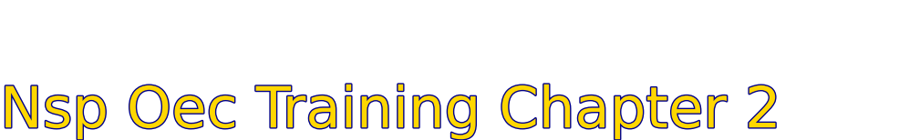

# Nsp Oec Training Chapter 2 - National Ski Patrol - Outdoor Emergency Care chapter 2
## National Ski Patrol (NSP) - Outdoor Emergency Care (OEC) - Chapter 2 - Emergency Medical Care Systems

## Chapter 2 - Emergency Medical Care Systems

1. List Several Attributes of an Emergency care system 
2. List four nationally recognised prehospital emergency care provider levels
3. Compare and contrast direct medical oversight and indirect medical oversight
4. Describe the purpose of quality improvement

## 2.1 List Several Attributes of an Emergency care system 

1. **Accessibility**: The system must be easily accessible to individuals in need of urgent care, with clear communication pathways like 911 or emergency hotlines.
2. **Timeliness**: Rapid response times are essential to ensure that patients receive immediate care, especially for life-threatening conditions.
3. **Coordination**: Seamless coordination between different parts of the system (e.g., first responders, hospitals, and specialized services) ensures efficient care delivery.
4. **Trained Personnel**: Emergency care systems rely on highly trained personnel, including EMTs, paramedics, nurses, and doctors, to provide competent and skilled care.
5. **Adequate Resources** Having sufficient medical equipment, ambulances, and facilities ensures that care is available when needed.
6. **Triage**: The system must include processes for prioritizing care based on the severity of a patient’s condition to ensure those most in need are treated first.
7. **Public Education**: Public awareness programs that educate the population on recognizing emergencies and contacting the system quickly can improve outcomes.

## 2.2 Four nationally recognized prehospital emergency care provider levels:

1. **Emergency Medical Responder (EMR)**: Provides basic emergency care and initial stabilization at the scene, including CPR, basic first aid, and bleeding control.
2. **Emergency Medical Technician (EMT)**: Offers more advanced care than EMRs, including patient assessment, basic airway management, and transport to medical facilities.
3. **Advanced Emergency Medical Technician (AEMT)**: Builds on EMT skills with additional capabilities such as administering IV fluids, advanced airway management, and some medications.
4. **Paramedic**: The highest level of prehospital care provider, capable of performing advanced procedures like endotracheal intubation, drug administration, cardiac monitoring, and more complex medical interventions.

These levels reflect a progressive increase in scope of practice and responsibility in emergency medical services.

## 2.3 Compare and contrast direct medical oversight and indirect medical oversight

1. **Direct Medical Oversight**: Real-time guidance and supervision provided by a physician or medical professional during emergency care.
- Examples: A paramedic calling a physician for advice while treating a patient, or a doctor overseeing patient care in real-time via radio or phone communication.
- Role: It ensures that prehospital care providers receive immediate input for complex decisions, such as medication administration or advanced procedures.

2. **Indirect Medical Oversight**: The development of protocols, guidelines, and training programs that EMS providers follow when delivering care, without real-time interaction with a physician.
- Examples: EMS protocols, standing orders, or regular training and certification requirements established by a medical director.
- Role: It provides structure and standardization to the care provided in the field, allowing EMS personnel to make decisions based on established guidelines when a physician is not available.

Comparison:
Both forms ensure quality and consistent patient care in EMS. Direct oversight involves real-time intervention, while indirect oversight focuses on pre-established guidelines and training for autonomous care.
In practice, EMS systems use a combination of both to ensure effective and efficient emergency care.

## 2.4 Describe the purpose of quality improvement (QI) in emergency care systems

The purpose of **Quality Improvement (QI)** in emergency care systems is to ensure that patient care is continuously assessed, improved, and optimized. QI aims to:

1. **Enhance Patient Outcomes**: By identifying areas where care can be improved, QI helps ensure that patients receive the best possible treatment, reducing complications and improving recovery rates.

2. **Increase Efficiency**: QI focuses on streamlining processes to reduce delays in care, improve response times, and make the emergency care system more efficient.

3. **Promote Safety**: It identifies potential risks and implements strategies to prevent errors, ensuring safer care for both patients and healthcare providers.

4. **Standardize Best Practices**: QI ensures that care is delivered according to evidence-based guidelines, leading to more consistent and reliable outcomes across the system.

5. **Encourage Ongoing Training**: By evaluating performance, QI programs highlight areas where additional training or education may be necessary for emergency care providers.

Overall, QI fosters a culture of continuous improvement, ensuring that emergency care systems adapt and improve to meet evolving medical standards and patient needs.

## Getting Started
To get started with the **Nsp Oec Training Chapter 2** solution repository, follow these steps:
1. Clone the repository to your local machine.
2. Install the required dependencies listed at the top of the notebook.
3. Explore the example code provided in the repository and experiment.
4. Run the notebook and make it your own - **EASY !**
    
## Solution Features
- Easy to understand and use  
- Easily Configurable 
- Quickly start your project with pre-built templates
- Its Fast and Automated

## Notebook Features

The goal of this solution is to **Jump Start** your development and have you up and running in 30 minutes. 

- **Self Documenting** - Automatically identifes major steps in notebook 
- **Self Testing** - Unit Testing for each function
- **Easily Configurable** - Easily modify with **config.INI** - keyname value pairs
- **Includes Talking Code** - The code explains itself 
- **Self Logging** - Enhanced python standard logging   
- **Self Debugging** - Enhanced python standard debugging
- **Low Code** - or - No Code  - Most solutions are under 50 lines of code
- **Educational** - Includes educational dialogue and background material
    
## List of Figures
    
    

## Github https://github.com/JoeEberle/ - Email  josepheberle@outlook.com 
    

    